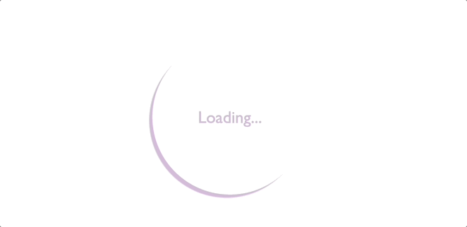

# 30-days-of-CSS
Challenge to create 30 mini projects using HTML and CSS in 30 days! 🤸🏻‍♀️

## Day01 - Social Media Icons

<a href="https://github.com/edlynshih/30-days-of-CSS/blob/main/Day01" target="_blank">Click here to view my code</a>

## Day02 - Animated Loader

<a href="https://github.com/edlynshih/30-days-of-CSS/blob/main/Day02" target="_blank">Click here to view my code.</a>

## Day03 - Sliding Text

<a href="https://github.com/edlynshih/30-days-of-CSS/blob/main/Day03" target="_blank">Click here to view my code.</a>