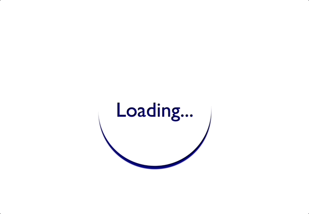
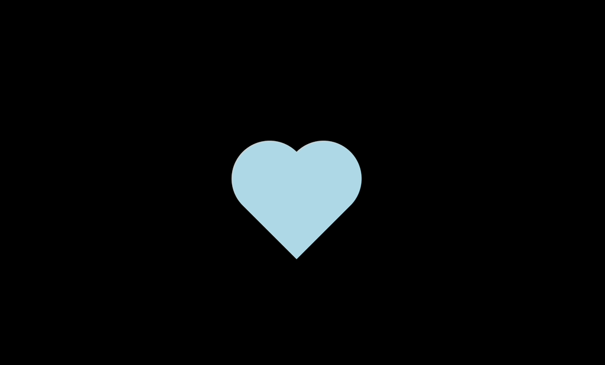

# 30-days-of-CSS
Challenge to create 30 mini projects using HTML and CSS in 30 days! 🤸🏻‍♀️

## Day01 - Social Media Icons

<a href="https://github.com/edlynshih/30-days-of-CSS/blob/main/Day01" target="_blank">Click here to view my code</a>

## Day02 - Animated Loader

<a href="https://github.com/edlynshih/30-days-of-CSS/blob/main/Day02" target="_blank">Click here to view my code.</a>

## Day03 - Sliding Text

<a href="https://github.com/edlynshih/30-days-of-CSS/blob/main/Day03" target="_blank">Click here to view my code.</a>

## Day04 - Button with Hover Effect

<a href="https://github.com/edlynshih/30-days-of-CSS/blob/main/Day04" target="_blank">Click here to view my code.</a>

## Day05 - Pulsing Effect

<a href="https://github.com/edlynshih/30-days-of-CSS/blob/main/Day05" target="_blank">Click here to view my code.</a>

## Day06 - Text Animation

<a href="https://github.com/edlynshih/30-days-of-CSS/blob/main/Day06" target="_blank">Click here to view my code.</a>

## Day07 - Preloader Animation

<a href="https://github.com/edlynshih/30-days-of-CSS/blob/main/Day07" target="_blank">Click here to view my code.</a>

## Day08 - Beating Heart Animation

<a href="https://github.com/edlynshih/30-days-of-CSS/blob/main/Day08" target="_blank">Click here to view my code.</a>

## Day09 - Newton's Cradle Animation

<a href="https://github.com/edlynshih/30-days-of-CSS/blob/main/Day09" target="_blank">Click here to view my code.</a>

## Day10 - Flashing Text Animation

<a href="https://github.com/edlynshih/30-days-of-CSS/blob/main/Day10" target="_blank">Click here to view my code.</a>

## Day11 - Button with Hover Fill Effect

<a href="https://github.com/edlynshih/30-days-of-CSS/blob/main/Day11" target="_blank">Click here to view my code.</a>

## Day12 - Fill effect when hovering

<a href="https://github.com/edlynshih/30-days-of-CSS/blob/main/Day12" target="_blank">Click here to view my code.</a>

## Day14 - Toggle Switch

<a href="https://github.com/edlynshih/30-days-of-CSS/blob/main/Day14" target="_blank">Click here to view my code.</a>